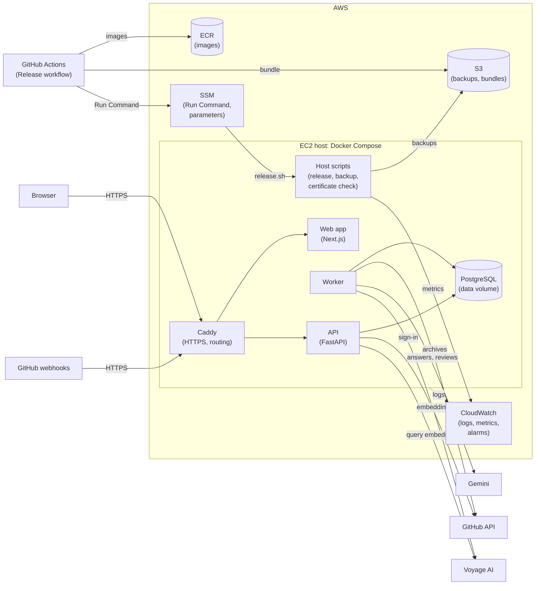

# CodeAtlas

CodeAtlas answers questions about a GitHub repository and reviews its pull requests, citing its
evidence. Every claim in an answer points to exact file and line ranges at the indexed commit, and
a question the code does not answer gets an "insufficient evidence" result instead of a guess.

CodeAtlas runs as an invitation-only pilot at a public HTTPS address. One AWS host runs every
service, Terraform defines the environment, each release waits for the operator's approval and
rolls back by itself when its check fails, CloudWatch alarms send alerts by email, and the database
is backed up to S3 every night (see [Deployment](#deployment)).

## What it does

- **Connect repositories** through a read-only GitHub App. Indexing runs in the background with
  visible progress and reports every skipped file with its reason (generated, binary, credential
  file, too large, and so on).
- **Stay current**: a push to a connected repository's default branch is indexed automatically,
  and a daily check catches pushes whose notification was missed.
- **Ask questions** about an indexed commit. Answers separate facts from inferences, and each
  citation opens the cited lines in the file browser.
- **Browse and search** the indexed commit: a file tree, file views, and text, path, symbol, and
  documentation search.
- **Review pull requests** on request: a summary of the change, risks ranked by severity with an
  overall risk level, a checklist for the human reviewer, and test suggestions. Every item cites
  the changed lines or related code on the correct side of the change, the review is pinned to
  the base, head, and merge-base commits, and it shows when new commits make it outdated. A review
  can be copied as Markdown; CodeAtlas never posts it to GitHub.
- **Stay contained**: each user has a private workspace, questions and reviews have daily
  allowances, and disconnecting a repository hides its data at once and purges it within 24 hours.
  When the owner loses access on GitHub, CodeAtlas stops serving the repository at once, and purges
  it unless access returns within 7 days. CodeAtlas never writes to GitHub and never executes
  repository code.
- **Admit only invited users**: in the pilot, only GitHub accounts on the access list (at most 10)
  can sign in. Anyone else sees an invitation page, and CodeAtlas keeps only an audit record of the
  denied sign-in. Pilot-wide daily limits on questions and reviews cap model spend, and sign-in and
  webhook requests are rate-limited per network address.

## Architecture

- **Frontend** (`frontend/`): Next.js, React, and TypeScript, with an API client generated from
  the API's OpenAPI document. The web app and the API share one origin.
- **API** (`backend/src/codeatlas/api`): FastAPI. It owns sign-in, authorization, workspace
  scoping, job creation, browsing, and search.
- **Worker** (`backend/src/codeatlas/jobs`): a Python process sharing the API's package. It
  downloads commit tarballs, extracts Python and TypeScript declarations with tree-sitter, builds
  the search indexes, generates answers, and reviews pull requests by diffing the merge-base and
  head archives.
- **PostgreSQL** with pgvector and pg_trgm is the only data store. It holds records, file
  contents, trigram and full-text search, documentation embeddings, and the job queue (claimed
  with `FOR UPDATE SKIP LOCKED`, with leases and fencing tokens).
- **GitHub App**: one App provides sign-in, read-only repository and pull request access, and
  webhook notifications of pushes and installation changes, verified by their HMAC signature.
- **Model providers**: Gemini 3.8 Flash generates answers and reviews in the worker from a bounded
  set of evidence as structured JSON, and the server validates every citation. Voyage AI embeds
  documentation during indexing and search queries in the API.

## Deployment

The pilot runs on one EC2 instance (`t4g.medium`, Arm) in AWS `us-east-1`, where Docker Compose
runs the same services as in development, with Caddy in front. Terraform in `infra/` defines the
environment, and `deploy/` holds the Compose file, the configuration, and the host scripts.

- **Edge**: Caddy serves HTTPS with a Let's Encrypt certificate and routes the API's paths to the
  API and everything else to the web app. Only ports 80 and 443 are open; administration goes
  through AWS Systems Manager, without SSH.
- **Data**: PostgreSQL runs in a container, with its data on a separate encrypted volume that
  outlives the instance. A nightly job dumps the database to S3.
- **Releases**: after CI passes on a push to `main`, GitHub Actions builds both images and posts a
  release summary (the commit, the commits since the running version, and new migrations), then
  waits for the operator's approval. Only then, with short-lived credentials from GitHub's OIDC
  provider, does it push the images to ECR, upload the release bundle to S3, and start the host's
  release script through SSM Run Command. The script migrates, starts the new release, checks it,
  and returns to the previous release when the check fails.
- **Monitoring**: the services' and host scripts' logs go to CloudWatch Logs. Ten alarms watch
  two external health checks, the worker's metrics, disk use, the EC2 status checks, the nightly
  backup, and the certificate, and email the operator through SNS when they fire and when they
  recover. A CloudWatch dashboard shows the last 7 days.
- **Credentials**: SSM parameters, rendered into the services' configuration on the host at each
  release. No container has AWS credentials, and GitHub stores no AWS key.



Temporary environments built from the same definition run the recovery exercise and the load test.

## Known limitations

- **The single host is a single point of failure.** If the instance or its data volume fails, the
  pilot is down until the host is replaced or rebuilt from the latest backup; there is no standby.
- **Releases interrupt service for up to 60 seconds**, while the services restart on that host.
- **Up to 24 hours of changes can be lost.** If the data volume is lost, the pilot is restored from
  the latest nightly backup, and changes made after it are lost. If a nightly backup fails and is
  not fixed before the next one, more than 24 hours can be lost.
- **GitHub notifications sent while the pilot is down are caught only by the daily check.** GitHub
  does not resend failed webhook deliveries, so a push or an access change made during an outage
  is picked up by the daily check, up to a day later.

## Data retention

- **Logs**: the logs of every service and host script are kept in CloudWatch Logs for 7 days. They
  carry request, job, run, and snapshot IDs, and never tokens, source text, prompts, or model
  output.
- **Backups**: the nightly database dumps are encrypted in S3 and expire 7 days after they are
  taken, rounded up to the next midnight UTC. Deleted data is purged from the database within 24
  hours, so it can remain in a backup for up to 10 days after deletion, as the external processing
  disclosure states.

## Run it

[specs/001-repository-qa/quickstart.md](specs/001-repository-qa/quickstart.md) covers
prerequisites, registering a development GitHub App, configuration, and the validation scenarios.
[specs/002-push-reindexing/quickstart.md](specs/002-push-reindexing/quickstart.md) adds the
webhook setup for automatic re-indexing.

To try it without a GitHub App or API keys, use fake mode. It serves fixture repositories from
`backend/tests/fixtures/repos` and uses fake model providers.

```bash
cp .env.example .env
# In .env, set CODEATLAS_ENV=development, CODEATLAS_FAKE_EXTERNALS=1, and TOKEN_ENCRYPTION_KEY
# (generate one with:
#  cd backend && uv run python -c "from cryptography.fernet import Fernet; print(Fernet.generate_key().decode())")
docker compose up -d db
docker compose run --rm migrate
docker compose up api worker web
```

Then open http://localhost:3000. The quickstart also shows how to run the API, the worker, and the
web app outside containers.

To run the pilot on AWS, follow the [operations guide](docs/operations.md): one-time setup,
releases, monitoring, backups, restoring, recovery, managing pilot users, and tearing down.
[specs/004-pilot-deployment/quickstart.md](specs/004-pilot-deployment/quickstart.md) has the
pilot's validation scenarios.

## Checks

From the repository root:

```bash
docker compose up -d db   # integration tests create a codeatlas_test database on this server
(cd backend && uv run ruff check . && uv run ruff format --check . && uv run mypy src && uv run pytest)
(cd frontend && npm run lint && npm run typecheck && npm run build)
(cd frontend && npm run test:e2e)   # Playwright, against the stack in fake mode
```

Set `TEST_DATABASE_URL` to give a test session its own database. The performance check for the
latency targets runs against a running stack in fake mode:
`cd backend && uv run python -m evals.perf_check --users 10 --duration 120` (see the module
docstring for the required settings).

CI also checks the deployment: Terraform formatting and validation of `infra/`, the host scripts
with ShellCheck and `bats deploy/tests`, and the Compose, Caddy, and CloudWatch agent
configurations (the `infra` job in `.github/workflows/ci.yml`).

## Measured results

Both reports are published after their measured runs and are not in the repository yet.

- [Load test](docs/reports/load-test.md): p95 latency and errors by kind of request (targets:
  searches 1.5 s, views 0.5 s, submissions 1 s) at 10, 20, 40, and 80 concurrent users, against a
  temporary environment with the pilot's host size and release images in fake mode; the highest
  level that meets every target; and the host's peak CPU and memory.
- [Evaluation](docs/reports/evaluation.md): precision and recall on Code Review Bench's Python and
  TypeScript pull requests, scored by the benchmark's judge, next to other review tools' published
  results; and the question and review sets run with the real model providers. Every number comes
  with its denominator.

## Documentation

- Repository Q&A: [specification](specs/001-repository-qa/spec.md), with the
  [plan](specs/001-repository-qa/plan.md),
  [research notes](specs/001-repository-qa/research.md),
  [data model](specs/001-repository-qa/data-model.md), and
  [HTTP API contract](specs/001-repository-qa/contracts/http-api.md)
- Automatic re-indexing and access revocation:
  [specification](specs/002-push-reindexing/spec.md), with the
  [plan](specs/002-push-reindexing/plan.md),
  [research notes](specs/002-push-reindexing/research.md),
  [data model](specs/002-push-reindexing/data-model.md),
  [webhook contract](specs/002-push-reindexing/contracts/github-webhooks.md),
  [HTTP API changes](specs/002-push-reindexing/contracts/http-api.md), and
  [quickstart](specs/002-push-reindexing/quickstart.md)
- Pull request review: [specification](specs/003-pr-review/spec.md), with the
  [plan](specs/003-pr-review/plan.md),
  [research notes](specs/003-pr-review/research.md),
  [data model](specs/003-pr-review/data-model.md),
  [HTTP API changes](specs/003-pr-review/contracts/http-api.md), and
  [quickstart](specs/003-pr-review/quickstart.md)
- Pilot deployment: [specification](specs/004-pilot-deployment/spec.md), with the
  [plan](specs/004-pilot-deployment/plan.md),
  [research notes](specs/004-pilot-deployment/research.md),
  [data model](specs/004-pilot-deployment/data-model.md),
  [HTTP API changes](specs/004-pilot-deployment/contracts/http-api.md),
  [operations contract](specs/004-pilot-deployment/contracts/operations.md), and
  [quickstart](specs/004-pilot-deployment/quickstart.md)
- [Operations guide](docs/operations.md) for the pilot
- [Architecture decision records](docs/decisions/):
  [application stack](docs/decisions/0001-application-stack.md),
  [PostgreSQL as the only data store](docs/decisions/0002-postgresql-as-the-only-data-store.md),
  [PostgreSQL job queue](docs/decisions/0003-postgresql-job-queue.md),
  [model providers](docs/decisions/0004-model-providers.md),
  [GitHub App](docs/decisions/0005-github-app-for-identity-and-access.md),
  [Gemini for answers](docs/decisions/0006-gemini-for-answer-generation.md),
  [GitHub webhooks](docs/decisions/0007-github-webhooks-for-change-notifications.md),
  [read-only pull request access](docs/decisions/0008-pull-request-read-access.md),
  [reviews from commit archives](docs/decisions/0009-pull-request-reviews-from-commit-archives.md),
  [one EC2 host with Docker Compose](docs/decisions/0010-single-host-aws-deployment.md),
  [Terraform and approved releases](docs/decisions/0011-terraform-and-approved-releases.md),
  [CloudWatch monitoring](docs/decisions/0012-cloudwatch-monitoring.md), and
  [pilot access list and limits](docs/decisions/0013-pilot-access-list-and-limits.md)
