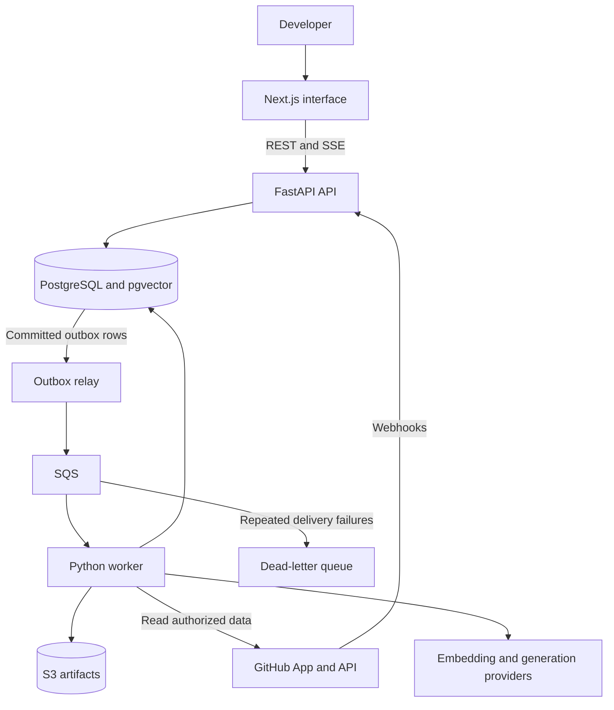

# CodeAtlas v1 System Design

**Status:** Draft for review  
**Date:** October 2, 2026  
**Audience:** The implementer and technical reviewers

> **Superseded in part (2026-10-05).** For the first increment (`specs/001-repository-qa`), ADRs
> 0002, 0003, and 0006 replace parts of this design. PostgreSQL stores file contents (no S3) and
> runs the job queue (no SQS or outbox). Progress uses polling instead of SSE. Answers use
> Gemini 3.8 Flash. For the second increment (`specs/002-push-reindexing`), ADR 0007 applies:
> webhook deliveries commit with their jobs without an outbox, and installation status lives on
> repository rows rather than in an installation table. Where this document and an ADR disagree,
> the ADR applies.

CodeAtlas is a web application that helps developers understand a GitHub repository and investigate a pull request or failed CI run using traceable evidence. This document defines the proposed first release, its implementation boundaries, and the checks required before a pilot deployment.

The proposed stack is TypeScript and Next.js for the interface, Python and FastAPI for the API, a separate Python worker, PostgreSQL with pgvector, Amazon SQS, and S3. The backend remains a modular monolith with separate API and worker processes. The design emphasizes explicit identity, durable jobs, immutable analysis inputs, and reproducible evaluation.

“v1” means the complete pilot release described here. Milestone M1 is the smaller first demonstration: connect one repository, build a snapshot, search it, and answer a question with citations. PR and CI analysis arrive in subsequent milestones.

All limits and performance thresholds below are proposed starting values, not measured results. This document does not claim that CodeAtlas has passed these checks.

## Problem and expected outcomes

Understanding a repository often requires switching between source files, documentation, PR discussions, and CI logs. A useful answer must identify both its evidence and the version of the repository to which it applies.

CodeAtlas will let a developer:

1. Connect an authorized repository and see indexing progress.
2. Browse files, symbols, and a bounded dependency graph at a specific commit.
3. Ask a repository question and follow citations to the supporting source.
4. Inspect a PR report showing changed files, potentially affected modules, relevant tests, and evidence gaps.
5. Inspect a failed CI run and see the failing step, relevant log excerpts, and possible causes.

The engineering objective is a complete service: API design, relational modeling, asynchronous processing, authorization, deployment, and measured quality.

## Release scope and assumptions

The pilot assumes one implementer and a small number of users. Each user initially owns a personal workspace. A membership table supports authorization, but invitations and shared team administration are deferred.

| Included in v1 | Deferred |
| --- | --- |
| GitHub sign-in and GitHub App repository authorization | Other Git providers and arbitrary repository URLs |
| Public and private repositories explicitly authorized for the pilot | Anonymous repository ingestion |
| Python and TypeScript syntax and import analysis | Complete call graphs or whole-program semantic analysis |
| Versioned source search and Markdown documentation retrieval | Repository-wide code embeddings and bulk historical Issue ingestion |
| Repository Q&A, on-demand PR reports, and failed CI diagnostics | Autonomous code changes, GitHub comments, merges, and deployments |
| Durable jobs, retries, progress events, and usage limits | General multi-agent planning and long-term conversational memory |
| English UI, API documentation, evaluation report, and deployment guide | Multi-region operation and enterprise availability guarantees |

The app will inspect source as data. It will not install repository dependencies, run build scripts, execute tests from imported repositories, or run arbitrary shell commands supplied by users or models.

Initial configurable limits are 10 repositories per workspace, 5,000 eligible files and 100,000 source lines per snapshot, 100 MiB of expanded source, and 1 MiB per text file. Each workspace may run one ingestion and one analysis job concurrently. CI log extraction is capped at 2 MiB per job. An oversized repository is rejected with a limit explanation; skipped files and truncated logs are reported as coverage limitations.

The first milestone embeds README and other eligible Markdown documentation. PR descriptions, diffs, check results, and CI logs are fetched for the requested analysis and preserved as evidence. Bulk indexing of historical discussions is outside v1.

## Architecture and component responsibilities

The API, worker, and outbox relay share a Python package and one migration history. Logical modules separate responsibilities without creating independently versioned microservices. The relay may run as another entry point in the worker container during the pilot.



| Component | Responsibility |
| --- | --- |
| Web | Repository browser, search, graph view, analysis reports, citations, and progress |
| API | Session validation, workspace authorization, input validation, job submission, and result queries |
| Ingestion module | GitHub reads, immutable source acquisition, file filtering, parsing, and snapshot publication |
| Retrieval module | Path and symbol lookup, lexical search, documentation vectors, and evidence ranking |
| Analysis module | Bounded Q&A, PR impact, and CI diagnostic workflows |
| Worker | Job claiming, checkpoints, provider calls, retries, and guarded result publication |
| Outbox relay | Deliver committed job notifications to SQS and record confirmed sends |
| PostgreSQL | Authoritative business records, job state, graph edges, evidence metadata, and document vectors |
| S3 | Immutable source bundles, sanitized logs, and larger analysis artifacts |

Next.js owns presentation rather than a second implementation of domain rules. FastAPI generates the OpenAPI contract; the frontend uses generated TypeScript request and response types. API and worker code use the same domain services and tenant-scoped data access.

PostgreSQL is sufficient for the initial relational graph and documentation vectors. Start with exact vector search within the authorized snapshot; introduce approximate indexes only after measurements justify them. The [pgvector documentation](https://github.com/pgvector/pgvector) describes hybrid retrieval and the recall implications of filtered approximate searches.

## Data model and ownership

Every tenant-owned record has a workspace identifier, directly or through a constrained parent. Queries must scope access before retrieval, ranking, pagination, or result delivery. Composite foreign keys prevent a child from referencing a parent in another workspace.

| Entity | Key fields and constraints |
| --- | --- |
| User | Internal ID and unique GitHub user ID |
| Session | Hashed session identifier, user, expiry, and revocation state |
| Workspace and Membership | Workspace ID, user ID, role; unique workspace and user pair |
| Installation | GitHub installation ID, owning workspace, permission state, and revocation timestamp |
| Repository | Workspace, installation, GitHub repository ID, display name, desired generation, active snapshot; unique workspace and GitHub repository pair |
| Snapshot | Repository, commit SHA, index version, status, source manifest, coverage metadata; unique repository, commit, and index version |
| File | Snapshot, normalized path, content hash, language, line count, and object reference; unique snapshot and path |
| Symbol and Dependency | Snapshot, file, declaration range or import edge, resolution status, and parser version |
| DocumentChunk | Snapshot, source range, text, embedding, embedding model, and content hash |
| WebhookDelivery | App ID, GitHub delivery ID, event type, processing status; unique app and delivery pair |
| Job | Workspace, requesting actor, kind, target, deduplication key, status, attempt count, lease expiry, fencing token, and retry time |
| JobCheckpoint | Job, stage, configuration version, accepted output reference, and fencing token |
| IdempotencyRecord | Workspace, route, key, payload hash, response reference, and expiry |
| OutboxEvent | Job ID, message schema version, minimal payload, publish status, and next delivery time |
| AnalysisRun | Workspace, repository, kind, pinned inputs, configuration versions, quality state, usage, and result |
| EvidenceItem | Run, source type, commit or external source revision, exact excerpt, source range, and checksum |
| RunEvent | Run, sequence number, event type, safe progress payload; unique run and sequence |
| AuditEvent | Actor, workspace, operation, resource, outcome, request ID, and timestamp |

Repository identity uses the GitHub numeric ID so a rename does not create a second repository. Two workspaces connecting the same upstream repository receive separate authorization and data records.

A snapshot identifies a commit together with an index version. The index version includes parser, chunking, and embedding configuration. Embeddings produced by different models or dimensions must not be mixed in one search space.

Job execution and answer quality are separate. A run can finish successfully with an “insufficient evidence” result. Provider failure produces an execution error, not an invented answer or a quality score of zero.

The API owns authorization and job creation. Workers own ingestion outputs, stage checkpoints, and analysis results through shared service methods. Workers do not create memberships or expand GitHub permissions. Database migrations run as an explicit deployment step.

## Repository ingestion and snapshot publication

Repository connection validates that the signed-in user can access the selected repository and that the linked installation can read it. The server resolves the branch to a commit SHA before scheduling work. A webhook is a change notification; the worker rechecks the authoritative branch head instead of treating webhook arrival order as commit order.

The ingestion workflow is:

1. Fetch source for the resolved commit through the authorized GitHub integration.
2. Validate paths and enforce limits while downloading and extracting.
3. Exclude secrets, binaries, generated files, symlinks, and dependency directories.
4. Store an immutable source manifest and sanitized eligible files.
5. Parse declarations and supported imports; build lexical search data.
6. Chunk eligible Markdown documentation and create versioned embeddings.
7. Verify the manifest, persist coverage information, and mark the snapshot ready.
8. Publish the active snapshot pointer in a short database transaction.

Readers use only ready snapshots. Failed builds leave the previous active snapshot available. An old build can publish to the default view only if its expected generation still matches the repository’s desired generation and commit. A PR-specific snapshot never changes that default pointer.

Incremental indexing compares content hashes with an earlier ready snapshot. Unchanged parsing and embedding results may be reused within the same workspace and configuration version. Reuse still creates snapshot-specific membership, so deleted files and renamed paths cannot survive accidentally in the new snapshot.

For PR analysis, persist the resolved base SHA, head SHA, and merge-base SHA. Evaluate the change from the merge base to the head and label evidence with the correct side and commit. If the head changes during analysis, keep the original report and mark it outdated. Fetching the new head creates a separate run.

Upload immutable artifacts before committing database references to them. A failed database transaction may leave an unreferenced object; a cleanup job removes such objects after a grace period. Do not assume that S3 writes and database commits are atomic.

No stage executes repository hooks, configuration scripts, or build commands. Unsupported syntax and unresolved imports appear in coverage metadata rather than silently becoming valid graph edges.

## Durable execution and failure recovery

The API verifies webhook signatures before processing payloads. Missing production webhook credentials fail configuration validation. The delivery ID, job, and outbox event are committed together before returning a successful response. A duplicate delivery receives a successful acknowledgment without creating another logical job. GitHub recommends responding within 10 seconds, so ingestion and model work remain outside the request path. [GitHub webhook guidance](https://docs.github.com/en/webhooks/using-webhooks/best-practices-for-using-webhooks)

The relay reads committed outbox rows, sends a versioned message containing a job ID, and marks the send complete. A crash between sending and recording completion can produce duplicate messages. This is expected under the [transactional outbox pattern](https://docs.aws.amazon.com/prescriptive-guidance/latest/cloud-design-patterns/transactional-outbox.html).

PostgreSQL is the authority for job state:

```text
queued -> running -> succeeded
             |
             +-> retry_wait -> running
             |
             +-> failed
             |
             +-> canceled
```

A worker atomically claims an eligible job, increments its attempt and fencing token, and sets a lease expiry. It renews the database lease and SQS visibility timeout while working. A duplicate consumer cannot claim an active lease. Every checkpoint and final publication checks the current fencing token, preventing an expired worker from overwriting the current attempt.

Persist stage outputs with unique keys and immutable artifacts. Commit the result and terminal event before acknowledging the SQS message. A duplicate message for a terminal job can then be acknowledged safely. A periodic reconciler requeues jobs whose leases expired or whose notification failed to produce progress.

Retry transient network failures, provider throttling, and temporary database errors with capped exponential backoff and jitter. Treat permission revocation, unsupported inputs, and size limits as terminal errors. Start with at most three processing attempts, a configurable 15-minute ingestion deadline, and a 3-minute analysis deadline. External requests have explicit per-call timeouts. Enforce workspace concurrency while claiming jobs under a database lock, rather than with process-local counters. Put persistently undeliverable messages in a dead-letter queue and surface the failure in both operations metrics and the job record.

[SQS standard queues can deliver messages more than once](https://docs.aws.amazon.com/AWSSimpleQueueService/latest/SQSDeveloperGuide/standard-queues-at-least-once-delivery.html). The contract is at-least-once execution with one accepted result publication, not exactly-once execution of external API calls. A model request interrupted after the provider accepted it may incur duplicate work or billing.

API mutations also accept an `Idempotency-Key`. A persisted record scopes the key to workspace, route, and payload hash for 24 hours. Reusing a key with a different payload returns a conflict.

| Failure | Required behavior |
| --- | --- |
| Database commit succeeds and SQS send fails | Relay retries the committed outbox event |
| Worker crashes after a stage | Another attempt reuses committed checkpoints and unfinished work resumes |
| Worker completes after losing its lease | Fencing check rejects its publication |
| Old commit finishes after a newer commit | Generation check preserves the newer active snapshot |
| GitHub throttles requests | Respect provider retry signals and retain progress |
| Generation provider is unavailable | Search remains available on ready snapshots; analysis reports a retryable error |
| Installation or repository access is revoked | Deny new reads, stop affected jobs, and reject late result publication |
| Browser closes | Job continues; progress and final output remain retrievable |

Run events have monotonically increasing per-run sequence numbers. The SSE endpoint supports reconnecting with the last received event ID, sends heartbeats, and checks authorization again when reconnecting or renewing a stream. Stored events describe stages and evidence; they do not expose private model reasoning. Initial event delivery may poll PostgreSQL at a bounded interval. Token-by-token streaming is deferred.

## Search and dependency analysis

Use separate retrieval paths for different kinds of information.

| Question or input | Authoritative source |
| --- | --- |
| File, symbol, configuration, or current implementation | Source and lexical index at the pinned snapshot |
| Repository documentation | Markdown chunks from the same snapshot, using lexical and vector retrieval |
| PR state, checks, or workflow status | GitHub API, with fetch time and source identifiers recorded |
| Explanation of a prior analysis | That run’s immutable input references, evidence, and result |

Exact path and symbol matches receive priority for code questions. Documentation retrieval combines lexical and vector candidate ranks using reciprocal rank fusion, then deduplicates overlapping ranges. The initial implementation caps the evidence set and context size. If query embedding is unavailable, return lexical results with an explicit degraded retrieval mode; never substitute fabricated vectors. Reranking is an optional later optimization, gated by retrieval evaluation.

Authorization and snapshot filters are part of retrieval queries. They must not be applied only after global candidates have been retrieved or sent to a model. Cache keys, if caching is introduced, include workspace, repository, snapshot, and retrieval configuration.

Use [Tree-sitter](https://tree-sitter.github.io/tree-sitter/) for syntax extraction and a small explicit resolver for supported Python and TypeScript imports. Tree-sitter supplies syntax trees; it does not establish a complete semantic call graph. Identify declarations by file, scope, kind, and location instead of a repository-wide name map.

The graph initially contains files, declarations, containment, and resolved imports. Keep unresolved imports as unresolved records. Bound traversal to two dependency hops and 500 returned nodes by default, and expose truncation to the client.

PR impact analysis walks reverse imports from changed files in the relevant before and after snapshots. Potentially related tests come from resolved imports and explicit filename or directory heuristics. Label these as candidate tests; CodeAtlas has not executed them and cannot claim that the set is complete.

## Analysis workflows and evidence contracts

Each run pins its repository inputs at creation. A request using “current” resolves that pointer once and records the chosen snapshot. Later stages must not substitute a newer snapshot.

The common execution flow is target resolution, evidence collection, bounded analysis, output validation, and persistence. Ordinary analysis uses one bounded workflow rather than an open-ended agent loop. Provider and prompt adapters remain replaceable.

| Run kind | Inputs | Output |
| --- | --- | --- |
| Repository Q&A | Question and ready snapshot | Answer, evidence references, and evidence gaps |
| PR impact | PR number, merge base, base and head commits, fetched metadata and checks | Change summary, candidate affected modules and tests, risks, and freshness |
| CI diagnosis | Workflow run ID, attempt, source commit, failed jobs, and sanitized logs | Failed step, diagnostic excerpts, possible causes, and suggested next checks |

A CI result is associated with the workflow attempt and source commit returned by GitHub. If that commit differs from the PR head, the report shows the mismatch instead of claiming that the run validates the latest code.

An evidence reference includes a source ID, repository identity, commit or external source revision, path or job identifier, line range, excerpt checksum, and fetch time where applicable. Server-side code constructs citation links and validates that quoted ranges exist. The model may select from supplied evidence IDs; it may not invent source locations.

Reports distinguish observed facts from possible explanations. A passing check is an observed fact only when retrieved for the relevant revision. A dependency path suggests possible impact rather than proving a behavioral regression. Insufficient evidence is a valid outcome.

Proposed starting limits are 20,000 input tokens, 2,000 output tokens, and at most two generation calls per analysis attempt, including one structured-output repair. Limit workspaces to 20 newly submitted analyses per day during the pilot. Reserve quota transactionally, account for each provider call, and expose usage. Select a concrete generation and embedding provider during M0 before creating production indexes.

Repository text, comments, and logs are untrusted evidence. The analysis layer has read-only tools scoped to its run. Tool arguments cannot expand the workspace or repository scope, obtain credentials, or trigger writes.

## API contract

Serve the web app and API under one origin. The table defines the intended contract surface; the implementation will generate the precise OpenAPI schema from Pydantic models.

| Method and route | Contract |
| --- | --- |
| GET /auth/github and GET /auth/github/callback | Start and complete sign-in; validate OAuth state and establish the app session |
| GET /v1/me | Return the authenticated user and accessible workspace |
| POST /v1/repositories | Validate installation and repository access, connect the repository, and return 202 with the initial ingestion job |
| GET /v1/repositories | List only repositories in the authorized workspace |
| POST /v1/repositories/{id}/index | Resolve the requested branch, create or reuse the snapshot build, and return 202 |
| GET /v1/jobs/{id} | Return authorized ingestion or processing state and safe error details |
| GET /v1/repositories/{id}/snapshots | List available snapshots and their coverage and freshness |
| GET /v1/snapshots/{id}/files | List files, or return a bounded line range for a normalized path |
| GET /v1/snapshots/{id}/graph | Return a bounded graph around a file or symbol |
| POST /v1/search | Search one authorized ready snapshot |
| POST /v1/analysis-runs | Submit a typed Q&A, PR, or CI request and return 202 |
| GET /v1/analysis-runs/{id} | Return execution state, pinned inputs, quality state, and result |
| GET /v1/analysis-runs/{id}/events | Stream persisted events using SSE |
| DELETE /v1/repositories/{id} | Revoke local access immediately and queue artifact cleanup |
| POST /v1/webhooks/github | Verify signature, deduplicate delivery, and persist work |

An example Q&A submission is:

```json
{
  "repository_id": "repo-example",
  "kind": "repository_qa",
  "target": {
    "snapshot_id": "snapshot-example"
  },
  "question": "Where are repository permissions checked?"
}
```

The asynchronous response contains `run_id`, `job_id`, `status`, `snapshot_id`, and relative `result_url` and `events_url` fields. The IDs above illustrate shape rather than a required ID encoding.

Return 401 for an absent session, 404 for inaccessible resources, 409 for incompatible state or conflicting idempotency input, 422 for invalid input, and 429 for quota exhaustion. Errors contain a stable code, safe message, retryability flag, and request ID. Lists use cursor pagination; graph, source, and search endpoints have explicit result limits.

## Identity and data protection

GitHub sign-in establishes the user identity. GitHub App installation permissions establish what the integration may fetch. Workspace membership and repository access establish what that user may read in CodeAtlas. An installation callback alone does not grant access; the backend verifies the installation and repository against the signed-in user before linking them. [GitHub App permission model](https://docs.github.com/en/apps/oauth-apps/building-oauth-apps/differences-between-github-apps-and-oauth-apps)

Use a server-side session with a Secure, HttpOnly, SameSite cookie, expiry, and logout invalidation. Apply CSRF protection to state-changing browser requests. Store session identifiers as hashes and keep provider credentials server-side.

Every route, worker claim, result publication, source download, and SSE stream validates tenant scope. Revalidate GitHub user access at most every 60 seconds for active access and process installation revocation events immediately when received. If cached authorization expires and refresh fails, fail closed. Permission changes missed by webhooks may therefore take up to the cache lifetime to affect an active session.

Keep GitHub App private keys and model credentials in a secret store, with distinct API and worker IAM roles. Logs must exclude tokens, full source, prompts, and raw CI output. Store sanitized artifacts under workspace and repository prefixes; use service authorization rather than object-name secrecy.

Source acquisition accepts repository identifiers through the GitHub adapter, not arbitrary URLs or local filesystem paths. Reject path traversal and symlink escapes, enforce expanded-size limits, and restrict network destinations and redirects to the integration’s approved hosts. Exclude known credential files before indexing or model submission. Secret detection is an additional filter, not a guarantee that arbitrary source contains no secrets.

The repository connection flow discloses that selected source excerpts may be sent to the configured model provider. Private repositories are enabled only for pilot users who accept that processing boundary; provider retention settings remain a deployment decision.

Deletion tombstones the repository immediately, denies all reads, marks queued work canceled, and prevents running work from publishing. Purge derived rows and objects within 24 hours. Retain old unreferenced snapshots for 14 days, analysis records for 30 days, and operational logs for 7 days by default. A snapshot or evidence artifact referenced by an unexpired run remains pinned. Backups may retain deleted data until their configured retention period expires.

## Deployment and operational behavior

Local development uses Docker Compose for the web app, API, worker, PostgreSQL with pgvector, and development adapters for queue and object storage. Queue failure behavior must also be validated against an isolated real SQS queue; passing emulator tests is not sufficient evidence.

The target pilot deployment uses ECS/Fargate for application containers, a private RDS PostgreSQL instance, SQS, S3, and CloudWatch. An HTTPS load balancer routes API and authentication paths to FastAPI and other paths to Next.js. API and worker replicas scale independently. An initial single database instance is an explicit availability tradeoff.

A lower-cost deployment may run the same containers on one EC2 instance while retaining SQS and S3. That profile has a single host failure domain and must not be described as highly available. The deployment profile and spending cap are selected during M0; no free-tier or monthly-cost assumption is made here.

GitHub Actions performs type checking, linting, unit and integration tests, container builds, and a staging smoke test. Deploy immutable image tags tied to a source commit. Use short-lived deployment credentials and record the release, schema, and prompt versions.

Run Alembic migrations as a deployment job. Prefer additive schema changes so the previous application version remains usable during rollback. Support the previous queue message schema during rolling updates. Roll back images after failed smoke tests; restore data from a backup only as a separate recovery procedure.

Expose liveness separately from readiness. Database failure makes data-serving endpoints unavailable; a generation-provider outage leaves repository browsing and search operational on ready snapshots. Configure graceful worker shutdown, database backups, an artifact lifecycle policy, and a documented restore exercise.

Structured logs and traces carry request, job, run, attempt, and snapshot IDs. Metrics cover queue age, job duration, retries, failed jobs, database latency, retrieval latency, provider errors, token usage, citation validation, and authorization denials. Alert on a growing queue or sustained worker failure, and provide a small operations view for retryable and terminal jobs.

## Validation and release gates

Use deterministic fixtures for API and state-machine tests, PostgreSQL integration tests for constraints and transactions, and Playwright for the main browser flows. Test with two users and separate workspaces even though team invitations are deferred.

Required correctness scenarios include:

- Replaying one webhook 100 times creates one logical ingestion job and one valid snapshot build.
- Killing a worker between stages permits recovery without duplicate accepted results.
- An expired worker cannot publish after another attempt takes its lease.
- A slower old-commit build cannot replace the current snapshot.
- A second user cannot enumerate, search, stream, or download another workspace’s data.
- Revocation or deletion prevents late publication and continued result access.
- A PR update leaves the earlier report pinned and visibly outdated.
- Renamed or deleted files do not leave stale results in the new snapshot.
- Invalid model evidence IDs and nonexistent source ranges are rejected.
- Traversal paths, oversized archives, and unsupported files produce defined outcomes.

Proposed performance gates use 10 concurrent users, ready snapshots, and documented hardware and configuration. Standard metadata endpoints should have p95 latency below 500 ms; accepted job submissions below 1 second; and search below 1.5 seconds. These measurements exclude provider generation time and initial indexing. Record query-embedding time separately from database retrieval time. Provider latency, errors, and time to completed answer must still be reported.

Benchmark repositories near 10,000, 50,000, and 100,000 source lines. Report cold and warm retrieval, full indexing time, incremental indexing time, input size, parser coverage, and resource use. Comparisons use identical source commits and configurations.

Build a versioned Q&A evaluation set with at least 50 questions, including answerable and intentionally unanswerable cases. Separate tuning cases from held-out cases. For answerable questions, target mean Recall@5 of at least 0.80 against labeled relevant evidence. Require every emitted citation to resolve to a valid source range and target at least 90% support for factual claims in a documented human audit. Target correct abstention on at least 80% of held-out unanswerable cases. Report denominators and failures, not only aggregate scores.

Add fixed PR and CI fixtures that verify affected-file evidence, revision freshness, workflow attempts, and handling of missing logs. An LLM judge may supplement these checks, but it cannot replace deterministic validation or human review.

A pilot release requires working end-to-end flows, the reliability and isolation scenarios above, a reproducible evaluation report, a successful restore exercise, and documented limitations. Failure to meet a target leads to a measured scope reduction or a fix; it must not be presented as a completed benchmark.

## Delivery milestones

The schedule is an estimate for one developer familiar with Python and TypeScript, working roughly 15 to 20 hours per week. Scope and available time should be reassessed after M1.

| Milestone | Intended timing | Exit condition |
| --- | --- | --- |
| M0 Decisions and contracts | First few days | Select deployment budget and model providers; define schemas, fixture repositories, and index version |
| M1 Repository Q&A | Weeks 1 and 2 | Sign in, connect one repository, run a durable snapshot job, search, and answer with valid citations |
| M2 Reliable synchronization | Weeks 3 and 4 | Webhooks, deduplication, lease recovery, incremental snapshots, and revocation checks pass failure tests |
| M3 PR and CI investigation | Weeks 5 and 6 | Import graph, PR impact, and CI reports preserve revision-specific evidence and disclose uncertainty |
| M4 Pilot readiness | Weeks 7 and 8 | Cloud deployment, isolation tests, performance measurements, quality evaluation, and recovery guide are complete |

M1 implements the minimum outbox and worker path immediately. M2 hardens that path and adds automatic synchronization; M1 does not depend on process-local background tasks that must later be replaced.

The first demonstration should tell one short story: connect a repository, inspect its structure, ask where a feature is implemented, and open the cited code. Extend that story with a PR and a failed CI run as later milestones land.

Deliver an English README, architecture diagram, OpenAPI specification, setup instructions, a short demo recording, a benchmark and evaluation report, and brief decision records explaining the major tradeoffs.

## Alternatives and unresolved decisions

| Alternative | Decision for v1 | Reason to revisit |
| --- | --- | --- |
| Java and Spring Boot API with a Python worker | Keep FastAPI | Team expertise or an existing Java platform justifies the added service boundary |
| Independent business microservices | Keep modules in one backend codebase | Teams or workloads need genuinely independent ownership and releases |
| Milvus or another dedicated vector database | Use pgvector | Measured retrieval scale or filtering requirements exceed the PostgreSQL design |
| Neo4j or another graph database | Use relational edges and bounded traversal | Complex graph queries become central and measured relational performance is insufficient |
| Kafka | Use SQS | Multiple independent consumers require retained streams and event replay semantics |
| Redis | Defer | Measurements justify caching, distributed rate limiting, or event fan-out beyond the database approach |
| Open-ended multi-agent orchestration | Use bounded workflows | Controlled evaluations show a material quality improvement that offsets latency and cost |
| Kubernetes | Defer | Operational requirements exceed the selected container platform |

The design can proceed with the stated defaults. Before enabling the pilot, resolve the generation and embedding providers, external processing settings for private code, a cloud spending cap, and the specific fixture repositories. Before expanding beyond personal workspaces, define invitation and repository-sharing policy. These are implementation decisions still to validate, not claims that the architecture has already been deployed.
